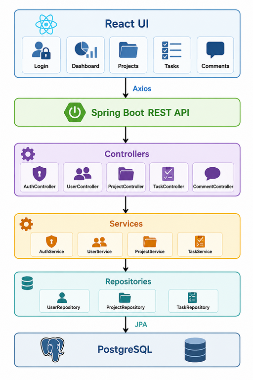
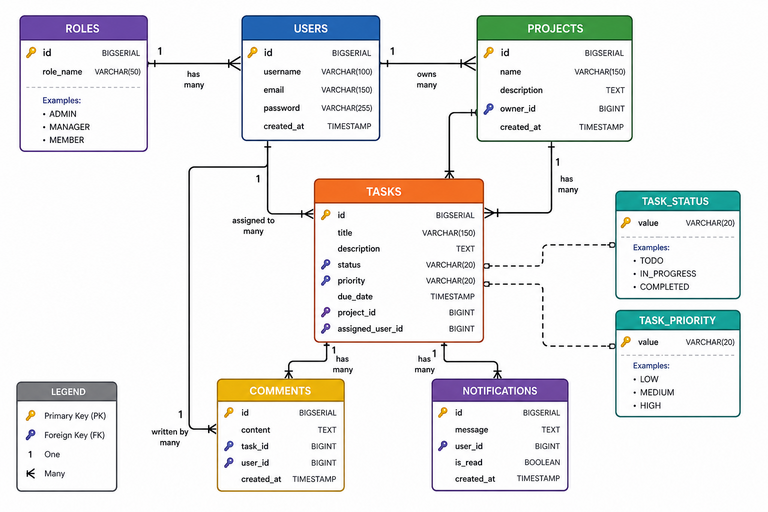

# Task Management Web Application

## Overview

A full-stack task management web application built using Spring Boot, React, PostgreSQL, and Docker.

The system allows users to create projects, manage tasks, assign responsibilities, track progress, and collaborate through comments.

This project was developed to demonstrate backend and frontend development skills, software architecture principles, authentication and authorization, database design, and containerization.

## System Architecture



## Features

### Authentication
- User Registration
- User Login
- JWT Authentication
- Role-Based Authorization

### Project Management
- Create Project
- Update Project
- Delete Project
- View Project Details

### Task Management
- Create Tasks
- Assign Tasks
- Update Status
- Set Priority
- Track Progress

### Comments
- Add Comments
- View Task Discussions

### Dashboard
- Total Projects
- Total Tasks
- Completed Tasks
- Pending Tasks

## Technology Stack

### Backend

- Java 21
- Spring Boot
- Spring Security
- Spring Data JPA
- Hibernate
- JWT
- Maven

### Frontend

- React
- React Router
- Axios
- Bootstrap

### Database

- PostgreSQL

### Infrastructure

- Docker
- Docker Compose

## Database Design



## Project Structure
```
backend
│
├── controller
├── service
├── repository
├── entity
├── dto
├── security
├── exception
└── config

frontend
│
├── pages
├── components
├── services
├── routes
└── hooks
```
## API Endpoints

Authentication:

POST /api/auth/register
POST /api/auth/login

Projects:

GET /api/projects
POST /api/projects
PUT /api/projects/{id}
DELETE /api/projects/{id}

Tasks:

GET /api/tasks
POST /api/tasks
PUT /api/tasks/{id}
DELETE /api/tasks/{id}

## Prerequisites

- Java 21
- Maven
- Docker
- Docker Compose
- PostgreSQL

## Running the Application

git clone https://github.com/Mahdi-Farhat/task-management-system.git
docker-compose up

## Design Principles

This application follows:

- Layered Architecture
- SOLID Principles
- Dependency Injection
- Repository Pattern
- Service Layer Pattern
- DTO Pattern
- Global Exception Handling

## Purpose

This project was created to simulate a real-world task management platform while applying professional backend and frontend development practices.

The goal is to gain hands-on experience with:

- Spring Boot
- React
- PostgreSQL
- JWT Authentication
- Docker
- REST API Design
- Software Architecture

## Learning Objectives

This project was built to strengthen knowledge of:

- Spring Boot Architecture
- REST API Development
- Spring Security
- JWT Authentication
- PostgreSQL Database Design
- Docker Containerization
- React Frontend Development
- SOLID Principles
- Repository Pattern
- Service Layer Pattern

## Future Improvements

- AI Task Prioritization
- Email Notifications
- File Attachments
- Real-Time Updates
- Activity Logs
- Team Collaboration Features
